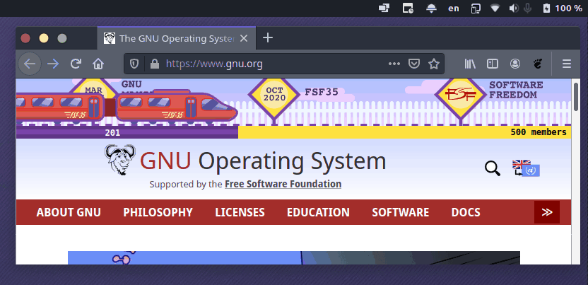
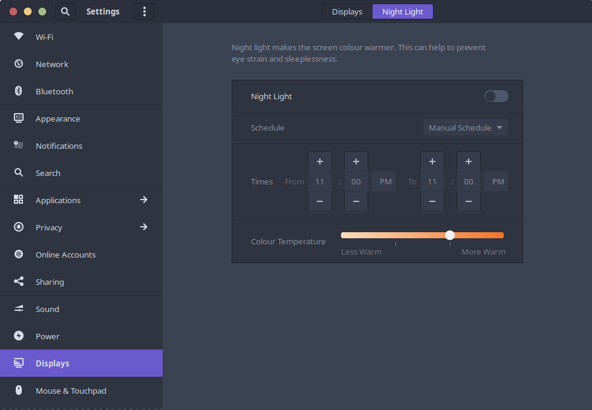

# gnome-shell-toggle-night-light-extension
This extension lets you toggle night-light from the top-bar by clicking it.

It seems like doesn't work because there are no color changes on demo.gif but this is just because screen capture doesn't capture night-lighted output. So, it works.

To make this extension much powerful, you can set a manual schedule from gnome settings like this.

Setting the "From" and the "To" as the same value allows you to use night-light anytime you want with a simple click on the extension.
